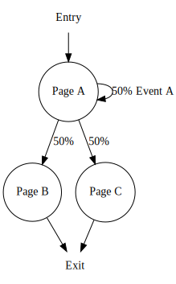
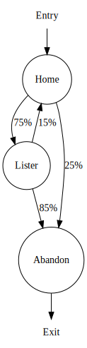

# Pensum Runner
The Pensum-runner scripts allow you to execute state-machine based load-tests using [K6](https://k6.io/).
[K6](https://k6.io/) is used to execute the HTTP calls and collect metrics.

> Pensum-runner is part of the Pensum toolset which helps you extract, model, and run realistic load-tests.

Tests can be created manually or extracted from historical data.
For the latter, the extractor helps you create workload models from historical data and is available in the [Pensum-extractor](https://github.com/avivasolutionsnl/Pensum-extractor) repository.

Pensum-runner consists of a number of scripts that helps you run a load-test **workload**. A workload is a collection of pages to visit and events to trigger for a single user (ie. website visitor). The order in which the pages are visited are (internally) modeled using a state-machine. A basic example of a workload is shown in the diagram below:



A workload model consist of a;
- entry, where a visitor enter the site,
- number of states, *Page A*, *Page B*, and *Page C* in this example,
- transition and associated probabilities to next state, e.g. from *Page A* to *Page B* *or* *Page C*" with a change of 50% for either of the pages,
- number of events and associated probability to perform per state, 50% chance to perform *Event A* in this example,
- exit, where the visitor leaves the website.

In Javascript code this workload is represented as follows:
```
const workload = {
    initial: 'home', // Corresponds to entry
    abandon: 'abandon', // Corresponds to exit
    states: [
    {
        name: 'Page A',
        events: [{
            name: 'Event A',
            probability: 50
            action: () => performEventA()
        }],
        targets: [{
            target: 'Page B',
            probability: 50
        }, {
            target: 'Page C',
            probability: 50
        }],
        action: () => visitPageA()
    }, 
    {
        name: 'Page B',
        targets: [{
            target: 'abandon',
            probability: 100
        }],
        action: () => visitPageB()
    },
    {
        name: 'Page C',
        targets: [{
            target: 'abandon',
            probability: 100
        }],
        action: () => visitPageC()
    },
    {
        name: 'abandon',
        targets: [],
        action: () => {}
    }]
}
```

To visit a page for a certain state an `action` function is defined. This function is executed right after the state, ie. page, is entered. When there are `events` present these are, based on configured probability, performed right after using the configured event `action` (ie. `performEventA` in above example).

## Prerequisites
- [K6](https://k6.io/) v0.26.0

## Install
First install K6:
```
PS> npm install k6
```

As K6 has limited possibilities for re-using Javascript libraries (see [docs](https://docs.k6.io/docs/modules)).
To use the runner in a load-test the easiest is to copy its files into your project.

For example download a Github release [here](https://github.com/avivasolutionsnl/Pensum-runner/releases) and copy the files into a sub-directory named `pensum-runner`.

Or use `degit` to scaffold pensum-runner into your project:
```
PS> npx degit https://github.com/avivasolutionsnl/Pensum-runner pensum-runner
```

## Usage
The most important API entrypoint is `runWorkload`, this method allows you to run a workload.

A workload is basically a state machine which models the behavior of a website visitor.
It starts at the `initial` state and terminates at the `abandon` state. When a state is entered it performs the defined `action` and (if any defined) an `event` from the given `events`. It transitions to the next state by inspecting the `targets`. It decides on what `target` and `event` to choose based on the given probabilities.

For example:
```
import runWorkload from 'shared/runworkload.js'

export default function myLoadTest {
   runWorkload({
        initial: '/',
        abandon: 'abandon',
        states: [{
            name: 'home',
            targets: [
                {
                    target: 'home',
                    probability: 50
                },
                {
                    target: 'abandon',
                    probability: 50
                }
            ],
            events: [
                {
                    name: 'transaction',
                    probability: 100,
                    action: () => performTransaction()
                }
            ],
            action: (thinkTime) => visitHomePage(thinkTime),
            thinkTime : {
                avg: 6, 
                std: 4, 
                min: 4, 
                max: 8   
            }
        },
        {
            name: 'abandon',
            targets: [],
            action: () => {}
        }]
   })
}
```
Note that you will have to implement the actions (e.g. `visitHomePage` and `performTransaction`) in the workload model yourself.

## Example
The [example.js](./example.js) script models a simple load-test. It contains a very basic load-test for an e-commerce based website and consists of 3 states;
- Visit home page
- Visit product lister page
- Abandon visit, ie. leave website

A (virtual) user always starts at the *Home* page and than transitions through the state machine. Each transition in the state machine has a probability assigned. In the example there is 75% chance that a user visits the *Lister* page when it leaves the *Home* page.

The state diagram for the example looks as follows:



### Run
To run the example use the K6 CLI tooling. For example:
```
PS> k6 run ./example.js
```

By default this runs one virtual user (VU) for 8 iterations, this is hard-coded in the example.
More details about how to control these parameters can be found [here](https://docs.k6.io/docs/running-k6).

### Reporting
K6 can automatically log to InfluxDb and results can be presented using Grafana.

> See the K6 official documentation about it [here](https://docs.k6.io/docs/influxdb-grafana)

To get this quickly up and running use Docker (with Linux containers):
```
PS> docker-compose up
```

and run K6 with InfluxDb output:
```
PS> k6 run ./example.js --tag Run=1 --out influxdb=http://localhost:8086/k6
```

View the (live) results in Grafana at http://localhost:3000/.
There are 3 example dashboards pre-defined (which are stored in [./grafana/provisioning/dashboards](./grafana/provisioning/dashboards)).

After a test run you can create a report using the reporter container.
This uses the [grafana-reporter] Docker image, its documentation you find [here](https://github.com/IzakMarais/reporter).
